# Grok Bot 101

Grok Bot, Grok Build, Cursor를 현장에서 쓰기 위한 안내서입니다. 이 파일이 **한국어 원본**이고, 장 순서는 `en.md`와 같습니다. 공식 핸드북은 본문에서 원문으로 연결합니다. 아직 없는 앱 화면은 자리를 비워 둡니다.

---

## 1. 이 책을 읽는 법

홍보 페이지가 아니라, 일하면서 펼쳐 보는 책입니다.

1. 목차를 한번 훑습니다.
2. 공식 시작하기 경로로 **봇 하나**를 만듭니다.
3. 공개 `x.ai/bot/…` 링크가 있으면 **Add to Grok Bot**. 없으면 Copy.
4. 비어 있는 화면은 본인 앱에서 찍어 채웁니다. 남의 비공개 화면은 넣지 마세요.

이 사이트는 비공식입니다. 동작 설명은 xAI 문서를 따릅니다. 목록, Portato, 이전 스킬은 getgrokbot.com의 MIT 부가물입니다.

---

## 2. Grok Bot이란

봇은 실제 일을 맡길 수 있는 AI 동료입니다. 클라우드 컴퓨터에서 앱과 웹사이트에 로그인하고, 서로 맥락을 넘기고, 승인이 필요할 때만 돌아옵니다. [원문](https://docs.x.ai/grok-bot/overview)

문서와 앱에서 Bot은 **이름 있는 상주 에이전트 하나**입니다.

공식 개요에서 다른 점 [원문](https://docs.x.ai/grok-bot/overview):

- **전용 컴퓨터.** 브라우저, 파일시스템, 터미널이 있는 클라우드 VM입니다. 커넥터나 MCP가 있으면 그걸 쓰고, 없으면 컴퓨터 사용으로 갑니다.
- **시작이 쉽습니다.** 봇을 만들고 메시지를 보낸 뒤, 필요할 때 접근을 주면 됩니다. 데스크톱과 iOS가 같습니다.
- **다른 봇과 맞춰 일합니다.** 계정 컴퓨터 하나를 공유하고 병렬로 돌 수 있습니다.
- **시연으로 워크플로를 배웁니다.** 한 번 따라 보게 한 뒤 스킬이나 루틴으로 저장합니다.
- **상주합니다.** 기억, 파일, 브라우저 세션, 선호가 남습니다.

getgrokbot.com은 스폰서 없는 디렉터리입니다. xAI 제품이 아닙니다. 공식 제품은 [x.ai/bot](https://x.ai/bot), 런칭 글은 [원문](https://x.ai/news/introducing-grok-bot)입니다.

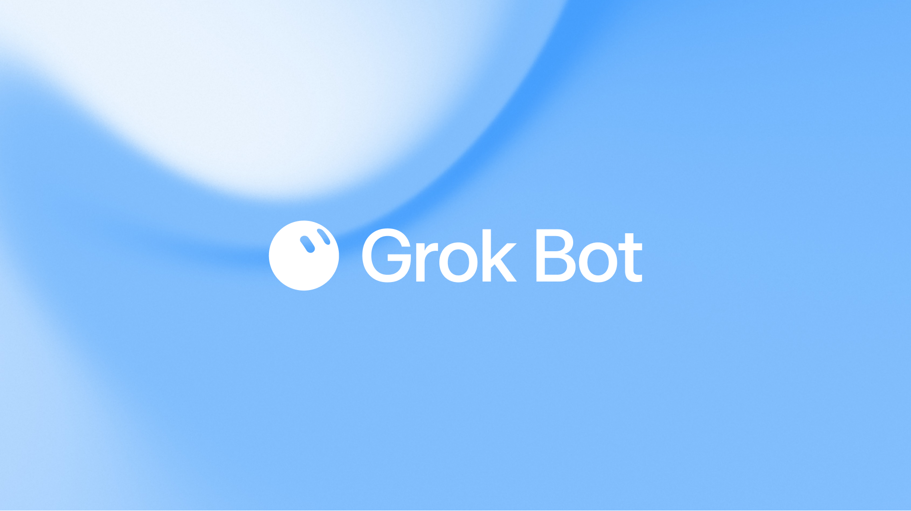

---

## 3. Grok 스택

세 화면이 같은 프론티어 모델 계열을 씁니다. 같은 제품은 아닙니다.

### Grok Bot

항상 켜진 동료입니다. 컴퓨터, 플러그인, 스킬(how), 루틴(when), 그룹 채팅이 여기에 있습니다. 템플릿과 Portato도 여기를 겨냥합니다.

### Grok Build

Grok으로 소프트웨어를 내는 xAI 빌드 화면입니다. 일이 레포나 디프, 제품 조각일 때 씁니다. 상주 인박스가 아닙니다. 봇은 컴퓨터에 코딩 에이전트를 깔고 일을 넘길 수 있습니다.

### Cursor

에디터입니다. Cursor 요금제 여러 개에 Grok Bot이 들어 있습니다. 데스크톱 온보딩은 [cursor.com/bot/onboarding](https://cursor.com/bot/onboarding)입니다. Cursor Agent(IDE)와 Grok Bot 동료를 섞지 마세요.

공식 핸드북 표지:

---

## 4. 이용 권한과 요금제

적격 요금제가 필요합니다. 공식 시작하기 목록 [원문](https://docs.x.ai/grok-bot/get-started):

- SuperGrok Plus
- SuperGrok Heavy
- Cursor Pro+
- Cursor Ultra
- Cursor Teams Standard 또는 Premium (Cursor 계정으로 로그인)

지금은 Linux 데스크톱 앱이 없습니다. iOS는 됩니다. [원문](https://docs.x.ai/grok-bot/get-started)

Grok Bot은 클라우드에 데이터를 저장해야 합니다. Legacy Privacy Mode 계정은 지원되는 Cursor 데이터 설정으로 옮겨야 합니다. [원문](https://docs.x.ai/grok-bot/get-started)

요금제 도움말은 [원문](https://cursor.com/help/grok-bot/plans), Cursor 가격은 [원문](https://cursor.com/pricing)입니다.

앱이 안 열리면 템플릿보다 요금제부터 확인하세요.

---

## 5. 데스크톱 앱 설치

공식 경로는 [Grok Bot 액세스 페이지](https://cursor.com/bot/onboarding)입니다. [원문](https://docs.x.ai/grok-bot/get-started)

### macOS

1. Apple silicon 또는 Intel을 고릅니다.
2. 디스크 이미지를 엽니다.
3. **Grok Bot**을 **Applications**로 끌어다 놓습니다.
4. 앱을 엽니다. macOS가 물으면 **Open**을 고릅니다.

**Apple 메뉴 → 이 Mac에 관하여**에서 **Chip**이면 Apple silicon, **Processor**면 Intel입니다. [원문](https://docs.x.ai/grok-bot/get-started)

### Windows

1. x64 또는 Arm64를 고릅니다.
2. 설치 프로그램을 실행합니다.
3. 시작 메뉴에서 Grok Bot을 엽니다.

업데이트는 자동입니다. **Check for Updates**는 **Settings → Beta**에 있습니다. [원문](https://docs.x.ai/grok-bot/get-started)

### 로그인

1. 환영 화면의 **Get started**, 또는 Settings의 **Sign In with Cursor**.
2. 브라우저에서 인증을 끝냅니다.
3. 앱으로 돌아옵니다.

Grok Bot은 Cursor 계정을 씁니다. SSO는 조직 로그인 흐름입니다. 처음 쓰면 봇, 공유 컴퓨터, 루틴을 소개한 뒤 쓰는 도구를 묻습니다. 그 답은 제안만 바꿉니다. 도구를 연결하지는 않습니다. [원문](https://docs.x.ai/grok-bot/get-started)

*아직 없는 화면입니다. cursor.com/bot/onboarding의 다운로드 선택 화면을 본인 앱에서 찍어 넣으세요.*

---

## 6. 첫 봇 만들기

공식 만들기 경로 [원문](https://docs.x.ai/grok-bot/bots):

1. 사이드바 **New**, 또는 `Cmd/Ctrl+N`.
2. **New chat**에서 **Create new agent**.
3. **New Agent**라는 봇이 열립니다.
4. **Bot actions → Edit Profile**에서 이름, 직함, 설명, 아바타를 정합니다.
5. 구체적인 일로 대화를 시작합니다.

봇마다 목표, 도구, 일하는 방식, 승인 경계, 일정이 달라야 합니다. 좋은 일은 Talent Scout, Expense Manager, Bug Reproduction입니다. General Helper는 붙잡을 게 적습니다. [원문](https://docs.x.ai/grok-bot/bots)

공식 예시 [원문](https://docs.x.ai/grok-bot/get-started):

> **Name:** Piper  
> **Job:** Product performance  
> **Description:** Investigate product-performance questions using our observability tools. Preserve links and screenshots, separate evidence from hypotheses, and return a short summary with the highest-impact issue first. Never change production settings.

계정은 봇과 그룹 채팅을 합쳐 **50개**입니다. [원문](https://docs.x.ai/grok-bot/bots)

집중된 봇이 만능보다 낫습니다. 일이 갈라지면 **New → Create new agent**로 나눕니다.

*아직 없는 화면입니다. Bot actions → Edit Profile에서 이름, 직함, 설명, 하지 말 것을 본인 앱으로 찍어 넣으세요.*

---

## 7. 첫 일을 주기

강한 요청은 다섯 조각입니다. [원문](https://docs.x.ai/grok-bot/get-started)

1. **결과** — 무엇이 끝나야 하나
2. **출처** — 어떤 앱, 파일, 대화
3. **제약** — 무엇을 피하거나 물어야 하나
4. **산출물** — 무엇을 돌려줘야 하나
5. **검토 지점** — 언제 멈추고 사람에게 오나

로그인 없이 5분 안에 끝나는 공식 프롬프트 [원문](https://docs.x.ai/grok-bot/get-started):

> Summarize this document in five bullets. List every date, decision, and open question in a separate section. Cite the page or section for each item. Do not change the source file.

그다음 도구를 쓰는 예:

> Open our analytics dashboard and compare new-user activation for this week with the previous four weeks. Identify the largest step-level change and draft a short investigation plan with links to the relevant charts. Do not change any dashboards. Ask me to sign in if needed.

공식 개요의 멀티툴 핸드오프 [원문](https://docs.x.ai/grok-bot/overview):

> Pull this week's Strategic Prospects PG List from Salesforce. Skip anyone already in a sequence. Research the top 5 accounts across the web, Slack, Databricks, and Sumble, pull contacts, and draft LinkedIn and email in my voice, and leave me drafts to approve by tomorrow morning

핵심은 무엇, 어디서, 맥락, 끝난 모양, 승인입니다.

바깥을 바꾸기 전에 [Approvals, security, and privacy](https://docs.x.ai/grok-bot/approvals-security-and-privacy)를 읽으세요. [원문](https://docs.x.ai/grok-bot/approvals-security-and-privacy)

---

## 8. 봇의 구조

- **프로필** — 이름, 직함, 맡는 일, 잘한 기준, 묻지 않고 하지 말 것, 첫 작업.
- **설명은 상주 규칙이고, 채팅은 이번 일입니다.** 「승인 없이 보내지 마」는 설명에 넣습니다. [원문](https://docs.x.ai/grok-bot/bots)
- **스킬은 how입니다.** 한 번 한 뒤에 저장하세요. 안 돌려 본 스킬을 스케줄하지 마세요. [원문](https://docs.x.ai/grok-bot/skills-routines-and-automations)
- **루틴은 when입니다.** 봇당 루틴 **50개**. 루틴마다 최근 실행 20개를 남깁니다. 삭제는 되돌릴 수 없습니다. [원문](https://docs.x.ai/grok-bot/skills-routines-and-automations)
- **기억은 원본이 아닙니다.** 변하는 사실은 소스 시스템에 두세요. [원문](https://docs.x.ai/grok-bot/bots)
- **Duplicate Bot**은 프로필, 설정, 켠 스킬, 루틴, 아바타를 복사합니다. 대화, 학습된 기억, 첨부파일은 복사하지 않습니다. [원문](https://docs.x.ai/grok-bot/bots)
- **Hide**는 사이드바에서만 뺍니다. 루틴은 멈추지 않습니다. [원문](https://docs.x.ai/grok-bot/bots)
- **Pin**은 위를 고정합니다.

흘려보는 열 개보다, 믿는 두 개가 낫습니다.

---

## 9. 공유 컴퓨터

계정 안 모든 봇이 **같은** 클라우드 컴퓨터를 씁니다. [원문](https://docs.x.ai/grok-bot/computer-and-apps)

- 브라우저 쿠키와 로그인 세션이 공유됩니다
- 파일이 모든 봇에 보입니다
- 커맨드라인 자격 증명이 공유됩니다
- 한 봇이 다른 봇이 저장한 일을 이어갈 수 있습니다

컴퓨터는 **봇이 아니라 계정**에 붙습니다. 다른 봇이 쓰면 안 되는 자격 증명을 올리지 마세요. 봇마다 **화면**이 따로여서 병렬로 돌 수 있습니다. 화면은 작업면이지 보안 경계가 아닙니다. [원문](https://docs.x.ai/grok-bot/computer-and-apps)

일을 보려면 대화에서 **Agent Computer**를 엽니다. 노트북을 닫아도 클라우드 일은 멈추지 않습니다.

공유 작업 공간은 `/workspace`입니다. 오래 가는 프로젝트 파일을 여기에 두세요.

Settings → Beta:

- **Update Agent Computer** — 최신 이미지, 내구성 있는 상태는 유지
- **Recover Agent Computer** — 컴퓨터에 닿지 않을 때
- **Reset Agent Computer** — 마지막 스냅샷. 저장하지 않은 일을 버릴 수 있음

맥·윈도우 본체는 별개입니다. 로컬 명령의 기본값은 **Ask every time**입니다. [원문](https://docs.x.ai/grok-bot/approvals-security-and-privacy)

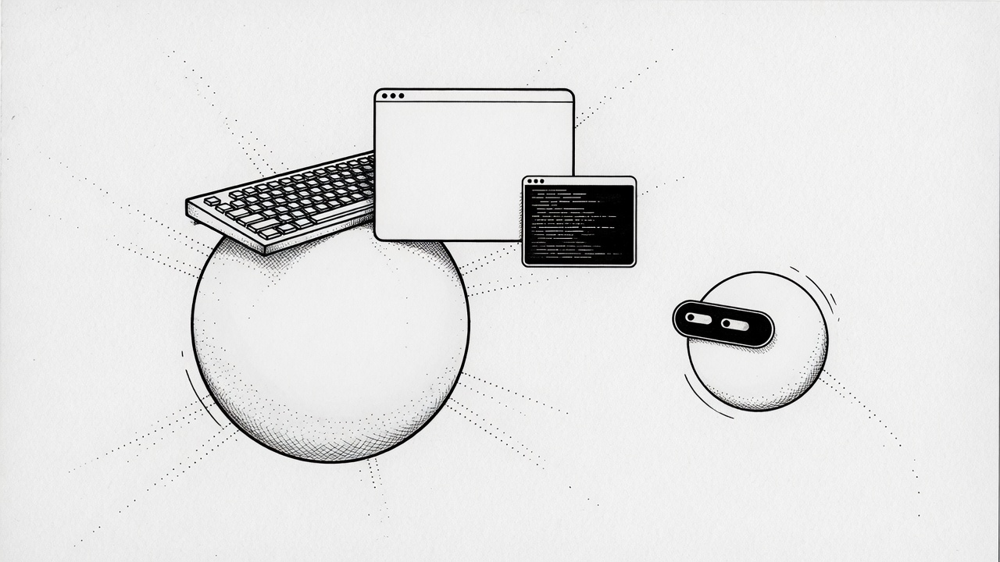

---

## 10. 플러그인과 로그인 벽

커넥터는 **Plugins**로 보입니다. 공식 연결 경로 [원문](https://docs.x.ai/grok-bot/computer-and-apps):

1. **Settings → Plugins**
2. 커넥터를 고릅니다
3. **Add**
4. 브라우저에서 인증합니다
5. 채팅에서 `@`는 커넥터, `/`는 저장한 스킬입니다

커넥터가 있으면 그걸 쓰고, 없으면 브라우저를 씁니다.

비밀번호, 패스키, 2FA, CAPTCHA, 결제, 본인 확인에 닿으면 [원문](https://docs.x.ai/grok-bot/computer-and-apps):

1. **Agent Computer**를 엽니다
2. 제어를 가져옵니다
3. 막힌 단계만 끝냅니다
4. 제어를 돌려주고 계속하라고 합니다

비밀번호나 일회용 코드를 채팅에 붙이지 마세요. 설치한 커넥터는 **계정 전체**입니다.

*아직 없는 화면입니다. 2FA에서 Agent Computer를 인수하는 장면을 본인 앱으로 찍으세요. 코드는 보이지 않게.*

---

## 11. 스킬(how)

스킬은 일을 하는 방법을 다시 쓰는 묶음입니다. 한 번 하고, 믿을 만하게 만든 뒤, 저장한 다음에만 자동화하세요. [원문](https://docs.x.ai/grok-bot/skills-routines-and-automations)

공식 저장 프롬프트:

> Save the process we just used as a skill called “Weekly account health.” Include the source systems, risk definitions, output format, and the rule that customer contact always requires approval.

쓸 만한 스킬에는 언제 쓰는지, 필요한 입력, 순서, 검증, 무엇을 돌려주는지, 무엇이 승인인지가 들어갑니다. [원문](https://docs.x.ai/grok-bot/skills-routines-and-automations)

**Teach a task**(있을 때): 브라우저 워크플로를 최대 10분 시연합니다. 마이크 오디오는 없습니다. 초안 스킬을 읽고, 시연에 없던 규칙을 보탭니다.

컨트롤이 없으면 끝난 일과 글로 스킬을 만들라고 하세요.

*아직 없는 화면입니다. 성공한 작업 한 번 뒤에 저장한 스킬을 본인 앱으로 찍어 넣으세요.*

---

## 12. 루틴(when)

루틴은 한 봇에게 언제 워크플로를 돌릴지 말합니다. 일정, 또는 지원되면 이벤트입니다. [원문](https://docs.x.ai/grok-bot/skills-routines-and-automations)

공식 평일 예:

> Every weekday at 8:00 AM, run the Daily customer-risk skill against the current account list. Post a linked watch list in this conversation. Do not contact customers. If the source data is unavailable, report the failure instead of using old data.

확인할 것: 소유 봇, 일정과 시간대, 입력, 기대 결과, 승인 경계, 소스가 없을 때.

**Test run은 실제 일입니다.** 웹을 돌고 파일을 바꾸고 도구를 부를 수 있습니다. 안전한 입력을 쓰고, 쓰기는 승인 뒤에 두세요. [원문](https://docs.x.ai/grok-bot/skills-routines-and-automations)

봇 → **View conversation details** → **Routines**에서 켜기, 일시정지, 테스트, 수정, 기록, 삭제를 합니다.

이벤트 트리거(슬랙 메시지, GitHub 알림)는 플러그인과 별개입니다. 규칙을 좁히고 「모든 새 메시지」는 피하세요.

신뢰를 위해: 실행 전에 준비하고, 초안을 먼저 두고, 보내기·결제·삭제·게시·프로덕션은 승인 뒤에 둡니다. 데이터가 없을 때의 정책과, 같은 일을 두 번 해도 안전한 재시도를 정하세요.

*아직 없는 화면입니다. 다음 실행 시각이 보이는 Routines를 본인 앱으로 찍어 넣으세요.*

---

## 13. 승인, 보안, 프라이버시

요청에 경계를 적습니다. [원문](https://docs.x.ai/grok-bot/approvals-security-and-privacy)

> Reconcile the campaign data and draft a recommended budget change. Do not change the campaign or message the agency. Ask for approval after showing the current value, proposed value, and expected impact.

보내기, 게시, 구매, 삭제, 권한 변경, 프로덕션, 약관 동의는 분명히 멈추세요.

데스크톱은 **Allow once**, **Deny**, **Always allow**. 아이폰은 **Approve once**, **Deny**. 대상을 모르면 승인하지 마세요.

**Auto Review**(있을 때): **Settings → General → Auto-review**. Require Approval이 Always Allow보다 앞섭니다. 규칙을 좁히고 「브라우저의 모든 것 허용」은 피하세요.

봇을 보안 경계로 쓰지 마세요. 컴퓨터를 공유합니다. 더 이상 쓰면 안 되는 서비스는 로그아웃하세요. [원문](https://docs.x.ai/grok-bot/approvals-security-and-privacy)

봇 공유도 보안 경계가 아닙니다. 공개 링크는 설정만 복사합니다. 그래도 비밀을 넣지 마세요.

Grok Bot은 Cursor 인증을 씁니다. Legacy Privacy Mode는 안 됩니다. [Cursor Privacy](https://cursor.com/privacy), [security](https://cursor.com/security).

---

## 14. 봇 공유(템플릿)

공식 공유 경로 [원문](https://docs.x.ai/grok-bot/bots):

1. 봇을 열고 공유 링크를 복사합니다.
2. 링크를 보냅니다. 받은 사람은 [x.ai](https://x.ai)에서 미리 보고 **Add to Grok Bot**을 고릅니다.
3. 마무리는 Grok Bot 앱이 필요합니다.

링크는 공개입니다. 정체성, 설명, 스킬, 루틴이 보입니다. 키, 내부 URL, 고객 데이터를 빼세요.

추가는 받은 사람 계정에 **사본**을 만듭니다. 컴퓨터, 로그인, 대화는 넘어가지 않습니다.

제3자 봇은 SpaceXAI가 만들지 않았습니다. 추가하면 [제3자 봇 약관](https://x.ai/legal/bot-sharing-terms)에 동의합니다. [원문](https://x.ai/legal/bot-sharing-terms)

**이 사이트에서 템플릿**은 X에 올라온 공개 `x.ai/bot/{token}`만 말합니다. getgrokbot은 그 주소를 발급하지 않습니다. 공유 링크가 없는 목록은 디렉터리 표에서 Copy입니다.

*아직 없는 화면입니다. 직접 Add 한 공개 템플릿의 공식 x.ai/bot 미리보기와 Add to Grok Bot 버튼을 찍어 넣으세요.*

---

## 15. X에서 퍼진 템플릿

다른 사람 설정을 붙여 넣지 마세요. 원문 포스트에 크레딧을 남기고, 공식 미리보기에서 Add 하세요. 전체 목록: [getgrokbot.com/templates](https://getgrokbot.com/ko/templates).

공식 템플릿 런칭 X: [원문](https://x.com/bot/status/2093376523919323618)

**dr eggbot** — [@poteto](https://x.com/poteto/status/2093392701005946931). 봇을 설계합니다. [Add](https://x.ai/bot/93gOz3op1UQdBdbekQFLK).

**Researchy** — [@farzyness](https://x.com/farzyness/status/2094148803494391903). Grok Build CLI, 최고 thinking. [Add](https://x.ai/bot/rQt4W2zO2Gx9lfcBjd1lj).

**Shepherd** — [@herdrdev](https://x.com/herdrdev/status/2094129284885467399). 봇 컴퓨터의 코딩 에이전트를 관리합니다. [Aaron 설명](https://x.com/theaaron/status/2093862565407494375). [Add](https://x.ai/bot/i5YF8f-zdcR76uKPrqg3J).

**Be Happier / Talent Matchmaker / Lennybot** — [@lennysan](https://x.com/lennysan/status/2093428147194847238).

**loops, Master, Chief of Staff, Growth Desk, Forge, Grok Bot Coach** — [Avid의 여섯](https://x.com/Av1dlive/status/2093747886324645924).

**Credit Card Max, Chef, unicode 라운드업** — [@unicodef1wn](https://x.com/unicodef1wn/status/2093402580697088455).

**Rewardsmaxxing** — [@ishuagra02](https://x.com/ishuagra02/status/2093910521435103509).

키를 빼세요. 되돌릴 수 있는 일 한 번만 돌려 보세요. 작성자 허락 없이 다시 나누지 마세요.

---

## 16. 공식 가이드에서 가져오는 구조

xAI 직무 가이드는 [x.ai/bot/guides](https://x.ai/bot/guides)입니다. [원문](https://x.ai/bot/guides). 기사를 다시 싣지 않습니다. **모양만** 가져옵니다. 일 하나, 명단 하나, 보드 하나. 그다음 원문 링크입니다.

### How I run multiple teams of Grok Bots

[원문](https://x.ai/bot/guides/how-i-run-multiple-teams-of-grok-bots) — 2026-08-27.

패턴: 프로젝트마다 Grok Bot 채널과 Notion 행이 있습니다. **projects Manager**가 메타 일(프로젝트 만들기, 채널 열기, 배치)을 맡습니다. 있는 봇을 먼저 씁니다. PM 말고 최대 다섯입니다. 새 봇은 당신이 예라고 한 뒤에만 만듭니다.

그 가이드의 공식 화면:

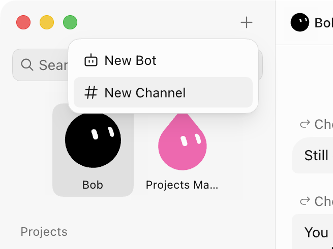

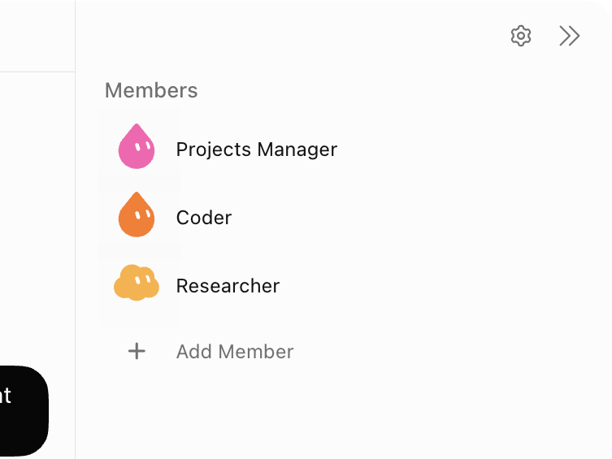

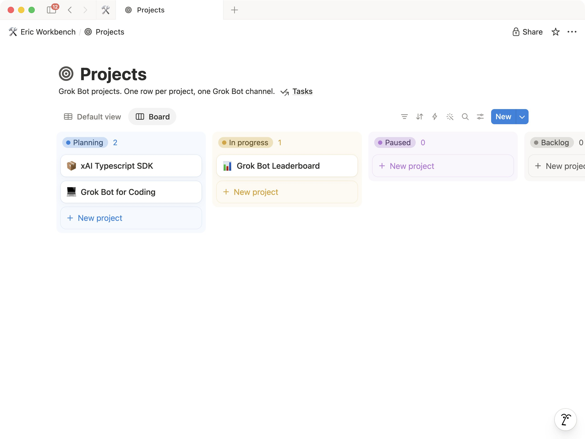

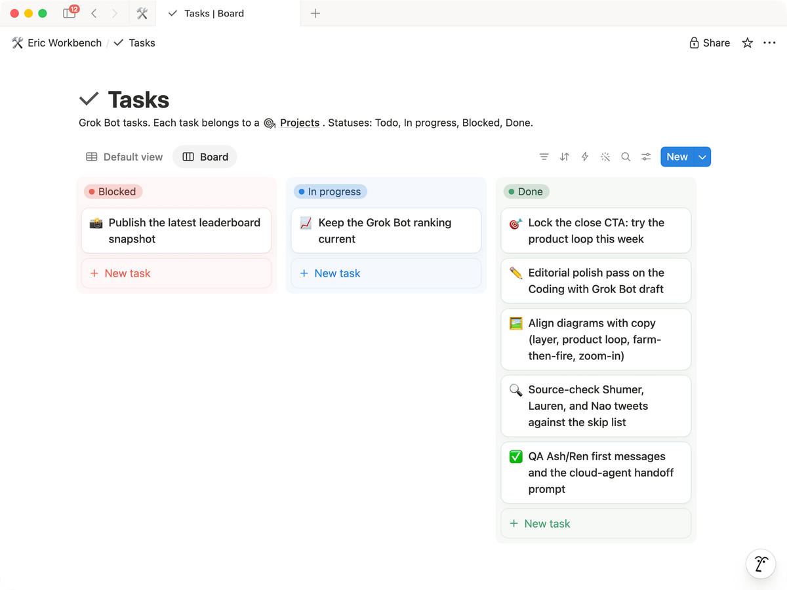

가이드 인덱스 커버(공식 아트, 밖으로 링크):

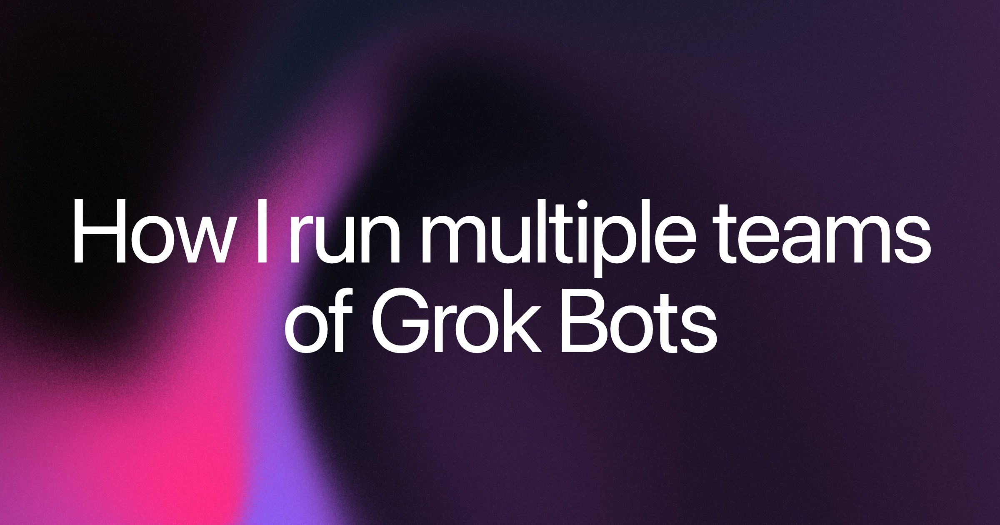

### Grok Bot for PMs

[원문](https://x.ai/bot/guides/grok-bot-for-pms) — 2026-08-15.

채택하는 **모양**입니다. 저자 명단을 붙이지 않습니다.

1. Slack, 메일, 캘린더, 미팅에서 나오는 **어텐션 리스트**. 금방 상하는 주간 우선순위 문서가 아닙니다.
2. **이름 있는 전문가**. 만능 한 칸이 아닙니다. 공식 이유: 누구 일인지 보이고, 병렬로 돌며, 기억 범위가 갈립니다.
3. 원문의 교훈: 자리마다 기억을 두고, 일하면서 배우고, 필요할 때만 말하고, 중요한 메시지는 사람이 보냅니다.

그 가이드의 공식 화면(고객 맥락 리서치):

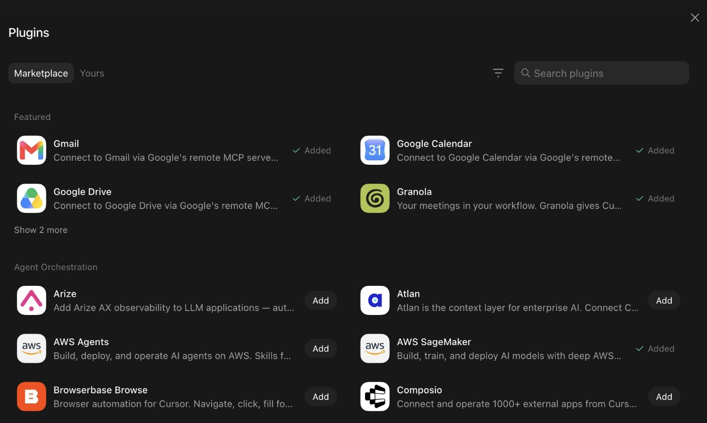

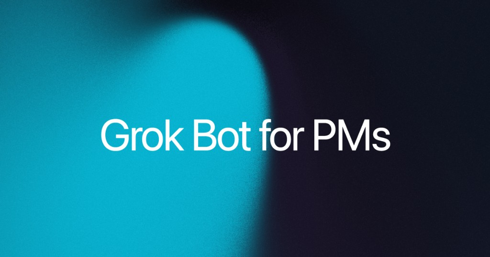

원문을 읽으세요. 내부 직무 목록을 템플릿으로 붙이지 마세요.

### Grok Bot for GTM

[원문](https://x.ai/bot/guides/grok-bot-for-gtm) — 2026-08-16.

채택하는 모양:

1. 새 조직도를 그리기 전에 이미 쓰는 도구(CRM, 메일, 캘린더, Slack, 노트, 슬라이드, 웨어하우스)를 연결합니다.
2. **Chief of Staff**가 조정합니다. 다른 봇은 일 하나: 미팅 준비, 프로스펙팅, 전략 계정 하나, 데이터, 제품 질문, 1:1, 포캐스트, 슬라이드, 콜 코칭.
3. 새 동료처럼 온보딩합니다. 한 번 시연하고, 스킬을 저장하고, 자랑할 만한 글을 먹이고, 인수인계가 보여야 하면 그룹에 넣습니다.

그 가이드의 공식 화면:

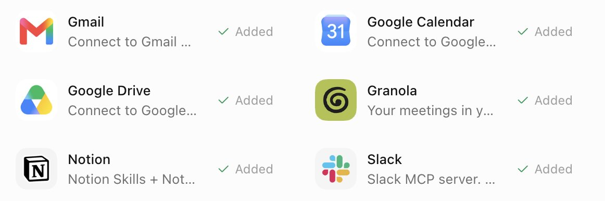

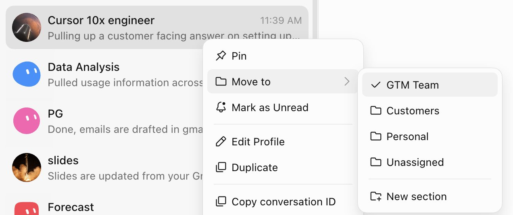

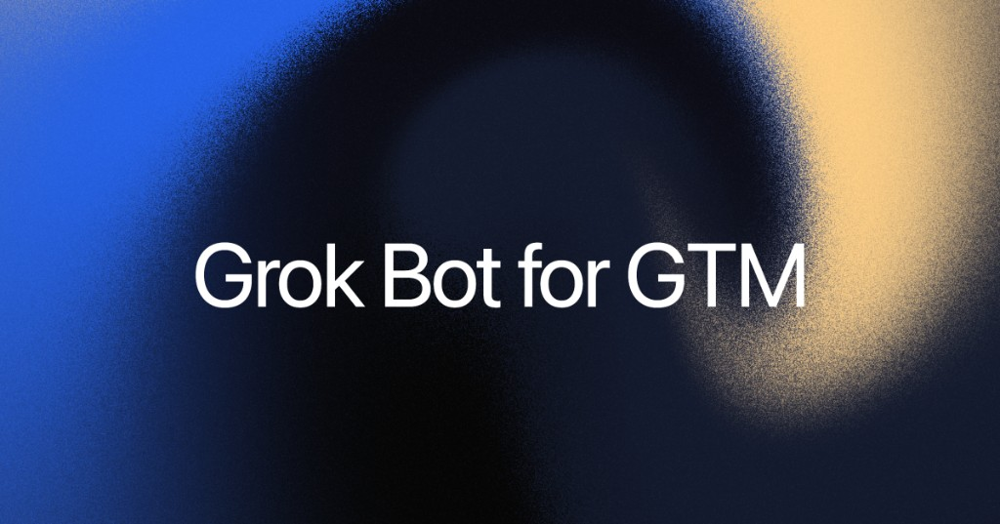

원문에 긴 “weekly media rundown” 프롬프트가 있습니다. 그건 그 사람 설정입니다. 필요하면 [원문](https://x.ai/bot/guides/grok-bot-for-gtm)을 보세요. 여기 복사하지 않습니다.

### Designing Grok Bot with Grok Bot

[원문](https://x.ai/bot/guides/designing-grok-bot-with-grok-bot) — 2026-08-24.

채택하는 모양:

- **Experiments** — 로드맵에 올리기 전에 판단할 만큼 실체를 만듭니다.
- **Motion** — 프로덕션 에셋을 두고 감으로 말합니다(“시선을 더 길게”). 추측한 밀리초가 아닙니다.
- **Figma 생산** — 실제 파일(좌표, 간격, 컴포넌트)을 봅니다. 로고와 열 번째 카드를 눈으로 맞추지 않습니다.

그 가이드의 공식 화면:

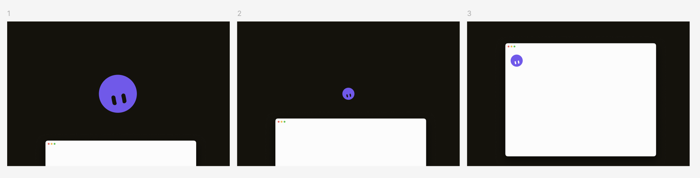

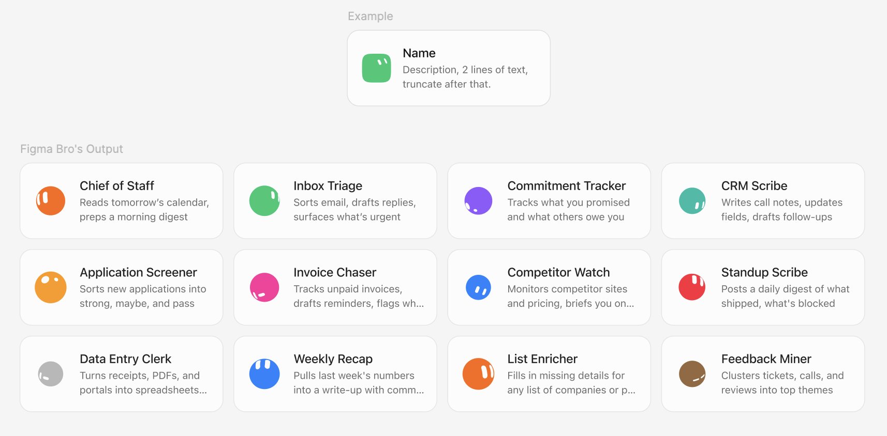

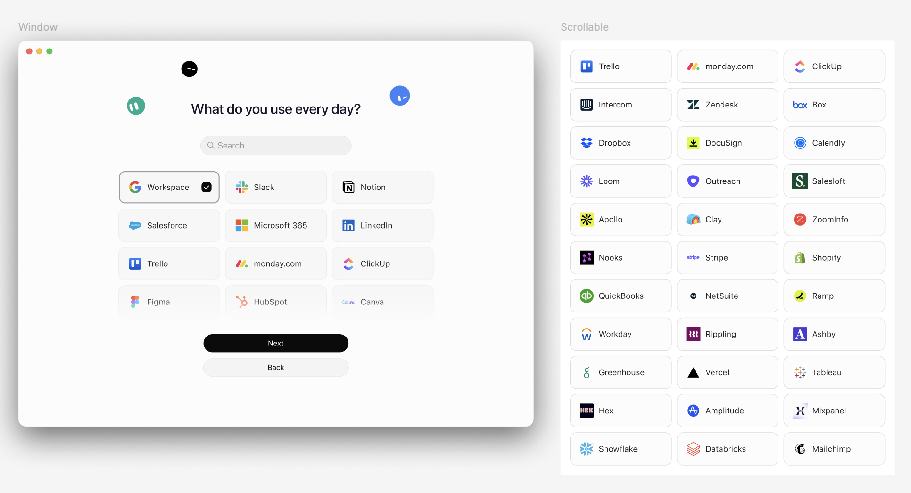

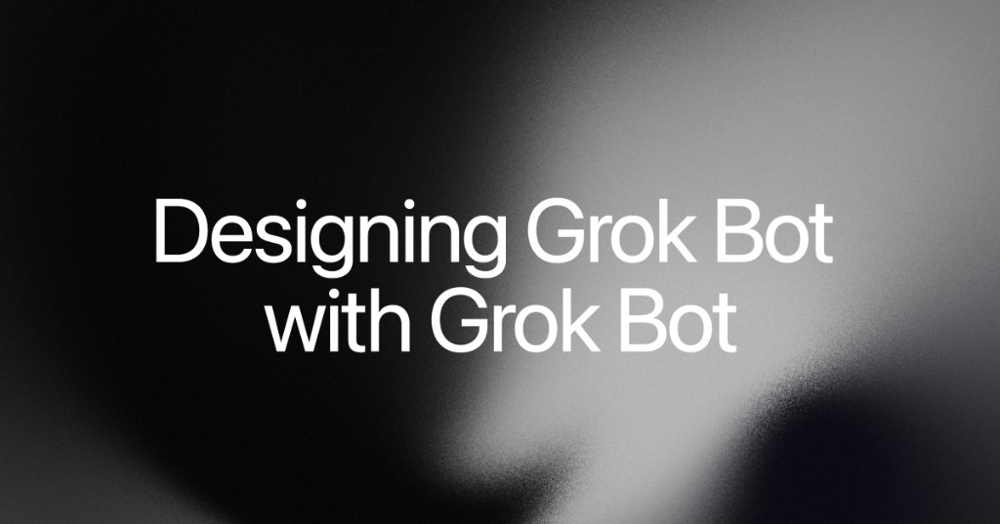

원문에 짧은 영상(노치, 코너, 커서 동반)이 있습니다. x.ai에서 보세요. 이 책은 그 클립을 넣지 않습니다.

### Grok Bot for mobile app development

[원문](https://x.ai/bot/guides/grok-bot-for-mobile-app-development) — 2026-08-25.

채택하는 모양: 게임 자체가 아닌 **나머지 85%** 여섯 자리 — UA, 퍼포먼스 크리에이티브, 클라이언트, 백엔드·라이브옵스, 릴리스, QA. 봇마다 직무, 연결, 컴퓨터, 루틴, 스킬, **핸드오프**가 있습니다. 발견을 선언하는 자리는 분석만입니다. 크리에이티브는 미디어를 사지 않습니다. 엔지니어는 제안이 아니라 스펙을 받습니다. 지출은 사람입니다.

그 가이드의 공식 화면(밤새 일을 넘기는 봇):

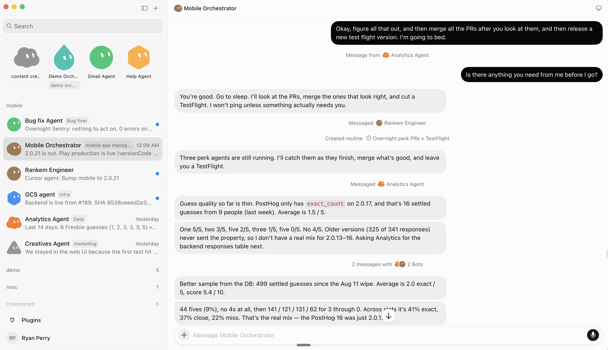

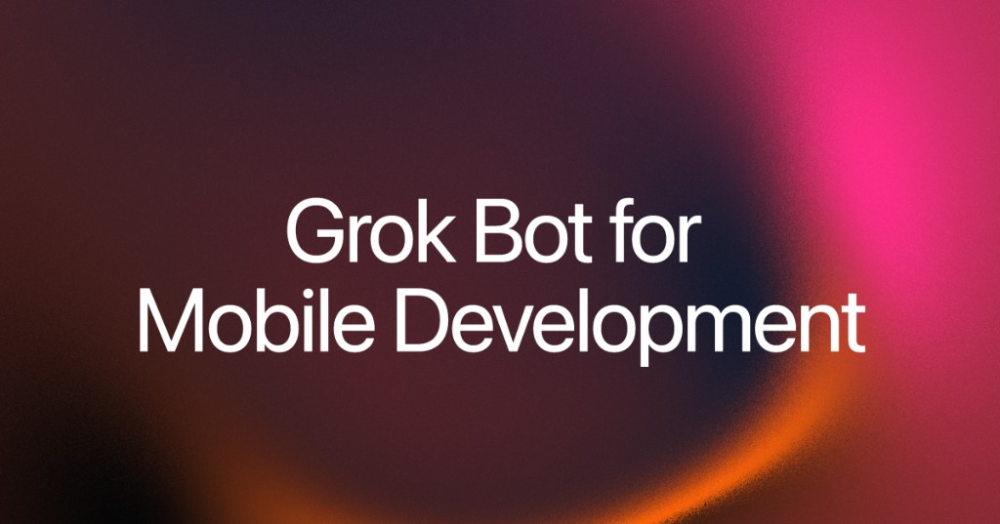

원문에 긴 Analytics 봇 설정 덤프가 있습니다. 그건 그 사람 설정입니다. [원문](https://x.ai/bot/guides/grok-bot-for-mobile-app-development). 여기 복사하지 않습니다.

Nate Herk 20분 워크스루(커뮤니티, xAI 아님): [원문](https://www.youtube.com/watch?v=PQBYZQqan2g).

---

## 17. 이 디렉터리를 어디에 쓰나

이미 있는 일은 X 템플릿을 씁니다. 붙여 넣는 프로필이나 Hermes / OpenClaw **Portato**가 필요할 때 이 목록을 봅니다.

- [Portato · Hermes](https://getgrokbot.com/ko/bots/porter-hermes)
- [Portato · OpenClaw](https://getgrokbot.com/ko/bots/porter-openclaw)
- [수신함 치프](https://getgrokbot.com/ko/bots/inbox-chief)
- [에이전트 설치](https://getgrokbot.com/ko/install)

새 조직도를 그리지 않는 구성:

1. dr eggbot을 Add 하고 Chief 하나를 설계해 달라고 한 뒤, 이 디렉터리 수신함 치프 프로필을 붙입니다.
2. Shepherd를 Add 하고 컴퓨터에 Codex 또는 Grok Build를 깔며, Grok Bot은 조정만 합니다.
3. Rewardsmaxxing을 Add 하되 카드 번호를 넣지 않습니다. 결제는 사람입니다.
4. Portato: 한 줄을 Hermes나 OpenClaw에 넣고, 골드 태스크 3–5개 뒤 컷오버합니다.

---

## 18. Portato (Hermes / OpenClaw)

Portato는 이 사이트의 이전 봇입니다. 이름은 모든 언어에서 **Portato**입니다. @poteto가 아니고 xAI 봇도 아닙니다.

Grok Bot에는 공식 Hermes·OpenClaw 가져오기와 공개 생성 API가 없습니다. 패킷이 길입니다. 첫 봇은 Chief 하나입니다.

1. 목록에서 Portato를 설치합니다(Copy, 공유 URL이 있으면 Add).
2. [migrate/hermes](https://getgrokbot.com/ko/migrate/hermes) 또는 [migrate/openclaw](https://getgrokbot.com/ko/migrate/openclaw)의 한 줄을 붙입니다.
3. 인벤토리가 먼저입니다. 그다음 골드 태스크 3–5개입니다.
4. 순서: 프로필 → 사실 파일 → 스킬(how) → 루틴(when).
5. 사람이 할 일은 로그인 벽입니다. 키, `.env`, 세션은 남깁니다.
6. 골드 태스크가 Grok에서 통과하고 소스 스케줄이 꺼진 뒤에만 컷오버합니다.

getgrokbot은 `https://x.ai/bot/…`를 발급하지 않습니다. 앱에서 만들고 Share as template 한 뒤 URL을 저장합니다.

---

## 19. 봇 컴퓨터의 코딩 에이전트

가능합니다. 봇에게 Claude Code, Codex CLI, OpenClaw, Hermes를 클라우드 컴퓨터에 깔라고 하면 됩니다. 붙여 넣는 프롬프트: [getgrokbot.com/install](https://getgrokbot.com/ko/install).

로그인은 사람입니다. 한도: Grok Bot은 조정하고, 무거운 코딩은 깐 CLI(Shepherd / Herdr)에 둡니다. [원문](https://x.com/herdrdev/status/2094129284885467399)

API 키를 채팅에 붙이지 마세요. 로그인 벽에서 멈추세요.

---

## 20. X와 Threads

**설치**를 올리세요. 비밀이 아닙니다.

할 것:

- 일 하나를 한 줄로
- `x.ai/bot` 링크와 누가 공유했는지
- 보내지 말 것 / 골드 태스크, 키 없음
- 공개 미리보기 스크린샷. `.env`가 아님

하지 말 것:

- 다른 사람 공유 설정을 붙여 넣기
- xAI 보증을 주장하기
- 고객 이름이나 카드 번호 스크린샷

공식 X: [원문](https://x.com/xai). 공식 Bot 계정 런칭: [원문](https://x.com/bot/status/2093376523919323618).

---

## 21. 아직 채워야 하는 화면

캡처를 `content/101/assets/`에 아래 이름으로 넣으세요. 없으면 웹과 PDF에 슬롯만 남습니다.

- `install-macos.png` — 액세스 페이지 다운로드 선택
- `edit-profile.png` — Edit Profile
- `plugin-login.png` — 2FA에서 컴퓨터 인수(코드 없이)
- `skill-save.png` — 저장한 스킬
- `routine.png` — Routines
- `add-to-grok.png` — 공식 x.ai/bot 미리보기
- `files-results.png` — 대화의 결과 카드
- `group-chat.png` — 봇 2–6개 그룹
- `ios-home.png` — 아이폰 홈, 동기화된 목록
- `settings-general.png` — Settings → General
- `computer-unreachable.png` — Recover computer 상태

고객 받은편지함과 `.env`는 올리지 마세요.

---

## 22. 출처

이번 판에서 연 문서:

- [개요](https://docs.x.ai/grok-bot/overview)
- [시작하기](https://docs.x.ai/grok-bot/get-started)
- [봇 만들기와 관리](https://docs.x.ai/grok-bot/bots)
- [메시지와 협업](https://docs.x.ai/grok-bot/chat-and-collaboration)
- [컴퓨터와 앱](https://docs.x.ai/grok-bot/computer-and-apps)
- [스킬과 루틴](https://docs.x.ai/grok-bot/skills-routines-and-automations)
- [파일과 결과](https://docs.x.ai/grok-bot/files-and-results)
- [승인, 보안, 프라이버시](https://docs.x.ai/grok-bot/approvals-security-and-privacy)
- [설정과 알림](https://docs.x.ai/grok-bot/settings-and-notifications)
- [iOS](https://docs.x.ai/grok-bot/mobile)
- [사용 예시](https://docs.x.ai/grok-bot/use-cases)
- [FAQ](https://docs.x.ai/grok-bot/faq)
- [문제 해결](https://docs.x.ai/grok-bot/troubleshooting)
- [제3자 봇 약관](https://x.ai/legal/bot-sharing-terms)
- [런칭](https://x.ai/news/introducing-grok-bot)
- [공식 가이드 인덱스](https://x.ai/bot/guides)
- [How I run multiple teams](https://x.ai/bot/guides/how-i-run-multiple-teams-of-grok-bots)
- [Grok Bot for PMs](https://x.ai/bot/guides/grok-bot-for-pms)
- [Grok Bot for GTM](https://x.ai/bot/guides/grok-bot-for-gtm)
- [Designing Grok Bot with Grok Bot](https://x.ai/bot/guides/designing-grok-bot-with-grok-bot)
- [Grok Bot for mobile app development](https://x.ai/bot/guides/grok-bot-for-mobile-app-development)
- [요금제](https://cursor.com/help/grok-bot/plans)
- [온보딩](https://cursor.com/bot/onboarding)
- [App Store](https://apps.apple.com/us/app/grok-bot/id6794501026)
- [템플릿 런칭 X](https://x.com/bot/status/2093376523919323618)

이 디렉터리, Portato, 이전 스킬은 비공식입니다. MIT.

---

## 23. 첫 주 계획

1일차. 설치하고 로그인한 뒤 봇 하나를 만듭니다. 문서 다섯 줄 일을 주고, 플러그인은 없습니다.

2일차. 플러그인 **하나**를 연결합니다. 그 도구에서 읽기만 하고, 로그인 벽에서 인수합니다.

3일차. 어제 방법을 스킬로 저장합니다. 다른 입력으로 테스트하고, 스케줄은 아직 두지 않습니다.

4일차. 소유자가 다른 일일 때만 두 번째 봇을 만듭니다. 인수인계 자체가 보여야 하면 그룹 채팅입니다. [원문](https://docs.x.ai/grok-bot/bots)

5일차. 스킬을 평일 루틴으로 바꿉니다. 데이터가 없을 때의 정책을 적고, 안전한 입력으로 Test run 합니다. 보내기·결제·삭제는 승인 뒤입니다.

6–7일차. 실제로 있는 일에 맞는 X 공개 템플릿 하나를 Add 합니다. 미리보기를 읽고, 모르는 것은 빼지 않습니다. 되돌릴 수 있는 일 한 번만 돌립니다.

농장처럼 느껴지면 멈춥니다. 여분 봇은 Hide, 여분 루틴은 Pause입니다.

---

## 24. 용어

- **Bot** — 이름 있는 상주 동료 하나. [원문](https://docs.x.ai/grok-bot/overview)
- **Computer** — 계정당 클라우드 VM 하나. 모든 봇이 공유합니다. [원문](https://docs.x.ai/grok-bot/computer-and-apps)
- **Plugin / connector** — 지원 서비스의 구조화된 접근
- **Skill** — how
- **Routine** — when. 봇당 50
- **Template** — 공개 `x.ai/bot/…`. 디렉터리 목록이 아님
- **Add to Grok Bot** — 그 링크로 하는 공식 설치
- **Copy** — Edit Profile에 붙이기
- **Portato** — Hermes 또는 OpenClaw용 이전 봇
- **Gold task** — 컷오버 전 이름 있는 입력과 기대 출력
- **Chief** — 첫 봇. Nexus가 아님
- **Share link** — 공개. 설정만. 컴퓨터와 로그인은 아님

---

## 25. 현장에서 보는 공식 FAQ

아래 답은 xAI FAQ입니다. [원문](https://docs.x.ai/grok-bot/faq)

**일반 어시스턴트와 무엇이 다른가.** 봇은 클라우드 컴퓨터, 연결된 도구, 웹사이트, 파일로 일을 끝냅니다. 백그라운드에서 이어가고, 역할 맥락을 유지하고, 다른 봇과 맞춰 일합니다.

**어디서 말하는가.** macOS·Windows 데스크톱, 아이폰 앱입니다. 같은 봇이 동기화됩니다.

**노트북을 닫아도 도는가.** 됩니다. 클라우드 컴퓨터입니다.

**봇들이 컴퓨터를 공유하는가.** 됩니다. 봇이 아니라 계정입니다. 봇을 보안 경계로 쓰지 마세요.

**여러 봇이 동시에 일하는가.** 됩니다. 화면은 봇마다입니다. 한 봇은 그 화면에서 컴퓨터 사용 작업 하나입니다.

**아무 웹사이트나.** 많은 사이트가 됩니다. 자동화 차단, 재로그인, CAPTCHA는 사람에게 넘깁니다.

**비용.** SuperGrok Plus, SuperGrok Heavy, Cursor Pro+, Cursor Ultra, Cursor Teams Standard·Premium. 주간 사용량입니다. Cursor와 SuperGrok가 둘 다 있으면 사용량이 더 많은 쪽입니다. [원문](https://cursor.com/pricing)

**플랫폼.** macOS(Apple silicon·Intel), Windows(x64·Arm64), iPhone iOS 18+. 초기 런칭 기준 Linux 데스크톱, Android, iPad는 없습니다. [원문](https://docs.x.ai/grok-bot/faq)

**봇을 지우면.** 활성 프로필, 대화, 루틴이 빠집니다. 공유 컴퓨터의 파일과 로그인은 남을 수 있습니다. 나중에 쓸지 모르면 Hide 하세요.

---

## 26. 파일과 결과

소스를 붙이고, 검사할 수 있는 결과를 달라고 하세요. [원문](https://docs.x.ai/grok-bot/files-and-results)

데스크톱 작성창: 첨부 최대 6개. 문서·이미지·오디오 각 25MB, 영상 200MB.

각 파일이 뭔지 말하세요:

> The PDF is the signed policy. The spreadsheet is this month’s transactions. Reconcile the spreadsheet against the policy, cite the relevant policy section for every exception, and return a new spreadsheet plus a short summary. Do not modify the originals.

중요한 일은 나눠 달라고 하세요. 소스에서 찾은 사실, 가정, 이미 한 행동, 승인 대기, 못 푼 질문.

강한 결과는 따로 검토할 수 있습니다. 소스 링크, 해당 상태 스크린샷, 타임스탬프와 시간대, 파일 이름, 행동 로그, 검증하지 못한 목록.

다른 봇이 `/workspace`에 저장한 파일을 읽을 수 있습니다. 최종 결과나 그 링크는 대화에도 남기세요.

*아직 없는 화면입니다. 대화의 결과 카드를 본인 앱으로 찍으세요. 고객 데이터는 빼세요.*

핸드북이 적는 입력: 이미지, 오디오, 영상, PDF·일반 텍스트, Word / Excel / PowerPoint, CSV / JSON / YAML / 소스, HTML·이메일, Jupyter. 너무 크거나 암호화·손상됐거나 형식이 특이한 파일은 못 읽을 수 있습니다. [원문](https://docs.x.ai/grok-bot/files-and-results)

봇이 컴퓨터나 커넥터로 닿을 수 있으면 링크를 붙입니다. 비공개 페이지는 로그인 또는 해당 플러그인입니다. 결과의 링크는 가능하면 앱 안 뷰어입니다. 자격 증명을 넣기 전에 목적지를 확인하세요.

산출물에 이름을 붙이세요. 제목과 출처 링크가 있는 문서, 열이 정의된 스프레드시트, 스피커 노트가 있는 덱, 스크린샷과 로그 폴더, 안 보낸 초안, 근거가 붙은 짧은 권고.

떨어진 복사본을 만들지 말고, 방금 만든 산출물을 고치라고 하세요:

> Update the report you just created. Add source links to the first two claims and replace the final table with a CSV attachment.

움직이는 숫자는 스크린샷만 믿지 마세요. 소스에서 링크나 수출한 파일을 남기세요.

---

## 27. 그룹 채팅과 핸드오프

Grok Bot은 동료에게 메시지 보내는 느낌입니다. 요청은 자연스럽게, 결과와 결정 경계는 분명하게 적으세요. [원문](https://docs.x.ai/grok-bot/chat-and-collaboration)

1:1에서는 텍스트·링크·이미지를 붙이고, 파일을 첨부하고, `/`로 저장 스킬, `@`로 봇·그룹·루틴·커넥터를 지정하고, 한 메시지에 답하고, 리액션하고, 일이 도는 동안 다른 지시를 보낼 수 있습니다. 대화에 도구, 컴퓨터 사용, 파일, 질문, 승인이 같이 보입니다.

당신 메시지가 백그라운드보다 앞섭니다. 당장 멈추려면 **Stop now**. 이미 한 일을 되돌리지는 않습니다.

**그룹**은 여러 봇이 결과 하나를 공유하고 인수인계 자체가 보여야 할 때 씁니다. [원문](https://docs.x.ai/grok-bot/chat-and-collaboration)

1. 사이드바 **New**.
2. **New chat**에서 봇 2–6개.
3. 생성된 그룹 이름을 고칩니다.
4. 공유 결과와 다음 단계 주인을 적습니다.

아이폰은 **+ → New Group Chat**. 멤버는 나중에 바꿀 수 있습니다. 계정은 봇과 그룹을 합쳐 **50개**입니다. [원문](https://docs.x.ai/grok-bot/bots)

메시지 보내기:

- 그냥 쓰면 참여 봇이 누가 답할지 고릅니다.
- 그 동료 일이면 `@` 하나.
- 정말로 각자 필요할 때만 여러 명.
- `@everyone`은 아끼세요.

공식 킥오프 [원문](https://docs.x.ai/grok-bot/chat-and-collaboration):

> @Researcher gather the source material and link every claim. @Writer turn the findings into a launch draft. @Reviewer check the draft against the sources and list only blocking issues. Do not publish anything.

봇은 다른 봇에게 비동기 메시지를 보낼 수 있습니다. 받는 쪽이 깨어 일하고 나중에 답합니다. 소스 주인과 산출물 주인이 다를 때, 초안을 전문가가 볼 때, 당신이 라우터가 되지 않고 긴 일이 이어져야 할 때 씁니다. **단계마다 주인 하나**. 병렬 핸드오프가 많으면 일이 겹칩니다.

당신 그룹 메시지에는 첨부가 됩니다. 봇이 그룹에 넘기는 메시지는 지금 **텍스트만**입니다. 다른 봇이 이미지를 봐야 하면 1:1로 보내세요. [원문](https://docs.x.ai/grok-bot/chat-and-collaboration)

한 결과나 한 승인에 대한 피드백은 **스레드**입니다. 가벼운 확인은 리액션입니다. 안전이 걸린 결정을 리액션만으로 하지 마세요.

*아직 없는 화면입니다. 봇 2–6개의 그룹과 보이는 핸드오프를 본인 앱으로 찍으세요. 고객 이름은 빼세요.*

---

## 28. 아이폰에서 쓰기

책상에서 떨어져 일을 시작하고, 질문에 답하고, 단계를 승인하고, 결과를 봅니다. 데스크톱과 **같은** 봇, 대화, 루틴, 커넥터, 공유 컴퓨터입니다. 앱을 닫아도 클라우드는 이어집니다. [원문](https://docs.x.ai/grok-bot/mobile)

필요:

- **iOS 18** 이상 아이폰
- 적격 요금제(데스크톱과 같음)
- 인터넷

지금은 **아이폰**용입니다. iPad·Android는 아닙니다. 다운로드: [App Store · Grok Bot](https://apps.apple.com/us/app/grok-bot/id6794501026) [원문](https://docs.x.ai/grok-bot/mobile)

로그인:

1. Grok Bot을 엽니다.
2. **Login with Cursor**.
3. 브라우저에서 Cursor 인증을 끝냅니다.
4. 앱으로 돌아옵니다.

새 사용자는 첫 투어, 첫 봇, 컴퓨터 준비입니다. 기존 사용자는 동기화된 목록으로 갑니다.

대화에서 텍스트, 받아쓰기, 사진, 파일, 다른 봇이나 그룹의 `@everyone`, 스레드 답, 리액션을 쓸 수 있습니다. 화면을 떠나면 대화마다 초안이 남습니다.

홈의 **+**는 **New Agent** 또는 **New Group Chat**입니다. 프로필, 그룹 멤버, 고정, 숨김, 삭제도 됩니다.

대화에서 컴퓨터를 열어 일을 보고, 비밀번호·2FA·CAPTCHA에서 인수하고, 현재 화면을 보고, 제어를 돌려줍니다. 같은 공유 컴퓨터입니다.

아이폰 루틴: 일정, 다음 실행, 지시를 보고 **Active**로 일시정지·재개합니다. 일정·지시 수정, 실행 기록, **Test run**, 삭제는 지금 **데스크톱**입니다. [원문](https://docs.x.ai/grok-bot/mobile)

홈에서 검색합니다. 스와이프로 고정·숨김입니다.

아이폰 Settings: 계정, 플러그인, 봇 설정, 있으면 Auto Review, 외관, 사용량 또는 적격 iOS 구독, 로그아웃·계정 삭제. Teach a task와 일부 고급 데스크톱 컨트롤은 아이폰에 없습니다.

봇이 결과·질문·승인을 알리게 하려면 알림을 켜세요. 푸시는 아직 롤아웃 중입니다. 푸시가 없어도 앱 안 주의 상태는 있습니다. **기기 권한**과 그 봇의 알림 설정이 둘 다 허용해야 합니다. [원문](https://docs.x.ai/grok-bot/settings-and-notifications)

*아직 없는 화면입니다. 동기화된 봇 목록이 보이는 Grok Bot 아이폰 홈을 본인 앱으로 찍어 넣으세요.*

---

## 29. 설정, 사용량, 알림

계정 메뉴 → **Settings**, 또는 `Cmd/Ctrl+,`. 일부 섹션은 계정마다 다릅니다. [원문](https://docs.x.ai/grok-bot/settings-and-notifications)

**General**

- **Account** — Grok Bot이 쓰는 Cursor 로그인. 메뉴에 **About**, 설치 버전, iOS 앱 링크.
- **Appearance** — Follow System, Light, Dark.
- **Agent** — 있으면 기본 모델, 루틴이 쓰는 **Timezone**, **Execution on Local Computer**, **Auto-review**.

로컬 컴퓨터 실행은 앞의 데스크톱에만 적용됩니다. Auto-review 규칙은 그 데스크톱에 저장되고 **그** Grok Bot 컴퓨터로 동기화됩니다. 다른 데스크톱 설치가 같다고 보지 마세요. [원문](https://docs.x.ai/grok-bot/settings-and-notifications)

**Plugins**

**Marketplace**는 커넥터와 패키지 스킬입니다. **Yours**는 설치한 플러그인과 비공개 스킬입니다. 설치 후에도 브라우저 인증이 필요할 수 있습니다. 도구는 하나씩 켭니다. 팀 플러그인은 필수거나 제한될 수 있습니다.

**Usage & Billing**(있을 때)은 비엔터프라이즈 적격 계정의 주간 포함 사용량과 온디맨드입니다. 계정 메뉴에 **Weekly usage**가 있을 수 있습니다. 둘 다 없으면 Cursor 계정 페이지나 조직 관리자에게 물어보세요.

**Team Setup**(보일 때): 관리자가 할당된 컴퓨터에서 돌아가는 관리 설정을 줄 수 있습니다. 관리 설정 문구에 **비밀을 넣지 마세요**.

**Beta**

- **Check for Updates** / **Restart to Update** — Grok Bot **앱**
- **Update Agent Computer** — 공유 컴퓨터 재빌드, 내구성 있는 상태는 유지
- **Reset Agent Computer** — 최후. 최근 동기화 안 된 일을 버릴 수 있음

앱 업데이트와 컴퓨터 업데이트는 별개입니다. 데스크톱 앱을 올린다고 클라우드 컴퓨터가 리셋되지 않습니다. [원문](https://docs.x.ai/grok-bot/troubleshooting)

**봇 하나:** **View conversation details → Agent settings**에서 이름, 직함, 설명, 아바타, 그 봇의 **Notifications**. 그룹 채팅에는 봇별 알림 스위치가 없습니다.

목록은 **Needs attention**(질문, 승인, 핸드오프)과 **Unread activity**(새 결과)를 가릅니다. 대화를 열면 현재 활동은 읽음이 됩니다.

Grok Bot이 포커스일 때 알림은 보통 나오지 않습니다. 사이드바와 독 배지는 그대로입니다.

앱 안 오류는 작성창 위 **Notifications**입니다. 어떤 것은 **Copy request ID**가 있습니다. 알림을 지워도 바깥 행동이나 봇 기록은 안 지워집니다. [원문](https://docs.x.ai/grok-bot/settings-and-notifications)

*아직 없는 화면입니다. Settings → General에서 시간대와 Auto-review가 보이게 찍으세요. 계정 이메일은 빼세요.*

---

## 30. 막혔을 때

가장 덜 파괴적인 단계부터 하세요. 데스크톱이나 아이폰 앱이 끊겨도 클라우드 일은 이어질 수 있습니다. [원문](https://docs.x.ai/grok-bot/troubleshooting)

**로그인이 안 끝남.** 브라우저가 인증하는 동안 Grok Bot을 열어 두세요. Cursor 로그인이 성공했는지 확인합니다. 포커스가 안 돌아오면 수동으로 앱으로 돌아옵니다. **Get started** 또는 **Sign In with Cursor**를 다시 시도하세요. 계정에 Grok Bot이 있는지 봅니다. SSO는 조직 로그인이고, 다른 개인 계정이 아닙니다. Legacy Privacy Mode 오류는 필요 저장을 막는 데이터 모드입니다. [원문](https://docs.x.ai/grok-bot/troubleshooting)

**컴퓨터가 아직 준비 중.** 첫 설정과 이미지 업데이트는 몇 분 걸립니다. **Starting your computer** 또는 **Updating your computer**가 끝날 때까지 기다립니다. 실패하면 재시도, 앱 재시작, 앱 업데이트, 그다음 **Update Agent Computer**.

**컴퓨터에 닿지 않음.** 프로필과 저장 대화가 반드시 사라진 것은 아닙니다. 순서:

1. **Retry** 또는 대화를 다시 엽니다.
2. Grok Bot 앱을 재시작합니다.
3. 있으면 **Recover computer** / **Recover Agent Computer**.
4. 복구가 없으면 **Settings → Beta → Update Agent Computer**.
5. 교체를 기다립니다.
6. 복구와 업데이트가 실패하고 최근 동기화 안 된 일을 버려도 될 때만 **Reset Agent Computer**.

Recover와 Update는 내구성 있는 파일과 로그인을 지킵니다. Reset은 마지막 스냅샷입니다.

**봇이 멈춘 것 같음.** 사이드바와 대화 상태를 봅니다. 컴퓨터를 열면 페이지, 질문, 승인, 로그인, CAPTCHA, 비밀 요청에서 기다릴 수 있습니다. 짧은 방향 전환, 또는 **Stop now**. 그 봇 화면의 컴퓨터 사용 작업 하나가 끝나야 다음이 시작될 수 있습니다. 사용량이 떨어지면 **Usage & Billing**.

**사이트가 계속 로그인을 물음.** 인수해서 직접 로그인하고, 2FA나 CAPTCHA를 끝낸 뒤, 로그인된 페이지가 뜨면 현재 페이지에서 계속하라고 하세요. 비밀번호를 채팅에 붙이지 마세요. 어떤 사이트는 민감한 행동마다 세션을 끊습니다.

**플러그인이 안 깔림.** **Settings → Plugins**에 있는지 보고, 상세에서 인증한 뒤 의도한 계정으로 재시도하세요. 소스 서비스가 권한을 끊었으면 제거하고 다시 연결합니다. 어떤 커넥터는 조직 변수가 필요합니다.

**첨부를 못 읽음.** 크기(25MB, 영상 200MB), 데스크톱은 한 번에 6개, 암호화 아님, 업로드가 끝남, 지원 형식. 형식이 특이하면 PDF, CSV, 텍스트, 이미지로 수출하세요. 데이터 정책을 깨면서 보호를 풀지 마세요.

**루틴이 안 돔.** 켜져 있는지, 일정과 시간대, 소유 봇, 플러그인 인증, 컴퓨터가 소스에 닿는지, 사용량이 멈췄는지를 봅니다. 실행 기록을 확인하세요. **Test run**은 실제 일입니다. 이벤트 트리거는 채널, 저장소, 매칭 규칙입니다.

**승인이 막힘.** 제안된 대상을 읽습니다. 카드가 낡았으면 거절·취소하고, 대체 지시를 주거나 범위를 고쳐 다시 만들라고 하세요. 계속 멈추면 Auto-review **Require Approval**이 Allow보다 앞섭니다.

**로컬 컴퓨터 일이 거절됨.** 클라우드와 로컬은 권한이 다릅니다. **Settings → General → Agent → Execution on Local Computer**. 기본은 **Ask every time**. 앞의 기계가 필요할 때만 허용하세요.

**지원 전에** 모을 것: Grok Bot 버전, OS와 버전, 정확한 오류, 봇 또는 루틴 이름, 대략 시각과 시간대, 있으면 요청 ID 또는 대화 ID 전체, 재시도·재시작·Update Agent Computer가 바꿨는지. 비밀번호, 일회용 코드, 개인 키, 비밀 값은 넣지 마세요. [원문](https://docs.x.ai/grok-bot/troubleshooting)

*아직 없는 화면입니다. Recover가 보이는 unreachable-computer 상태를 본인 앱으로 찍으세요. 비밀은 빼세요.*

---

## 31. 공식 사용 예시

핸드북 사용 예시 페이지는 **모양**을 가져올 직무 목록입니다. 각 역할은 반복 가능한 결과를 맡습니다. 느슨한 질문 묶음이 아닙니다. 읽고 준비하는 일부터, 검토, 그다음 승인된 행동이나 루틴입니다. [원문](https://docs.x.ai/grok-bot/use-cases)

**Sales Outbound**은 계정 리서치, 연락처 우선순위, 검토용 아웃리치입니다. 공식 시작:

> Research the 25 accounts in this CRM view. Score them against our ideal customer profile (ICP) and recent intent, identify up to three relevant contacts per account, and draft email and LinkedIn outreach in the style examples attached. Skip anyone already in an active sequence. Return a review list; do not send or enroll anyone.

**Talent Scout**은 소싱, 리서치, 아웃리치 초안, 일정 준비입니다. 승인 전까지 연락하지 않습니다. 후보자 프라이버시, 지역 규칙, 소스 약관을 지킵니다.

**Paid Media**는 캠페인 모니터링과 예산 권고입니다. Slack 초안입니다. 예산을 바꾸거나 보내지 않습니다.

**Expense Manager**는 주간 대사와 빠진 정보 팔로업입니다. 요약과 초안입니다. 메시지를 보내거나 환급을 바꾸지 않습니다. 예외마다 정책을 인용합니다.

**Product Performance**는 근거 있는 조사입니다. 사실과 가설을 나눕니다. 알림이나 프로덕션을 바꾸지 않습니다.

**Bug Reproduction**은 재현 팩입니다. 스테이징의 새 테스트 계정입니다. 프로덕션 고객 데이터는 금지입니다. 테스트 자격 증명은 채팅이 아니라 안전한 핸드오프입니다.

**Account Health**는 리스크와 확장 신호입니다. 근거가 있는 워치 리스트입니다. 고객에게 연락하거나 CRM을 고치지 않습니다. 리스크 임계값은 설명에 둡니다.

**Chief of Staff**는 무엇이 바뀌었고 결정이 필요한지의 출처 링크 다이제스트입니다. 적힌 우선순위에 맞는 것만 올립니다. 메시지를 보내거나 미팅을 바꾸지 않습니다. 쓸모와 소음을 표시한 뒤 다이제스트를 스케줄합니다. [원문](https://docs.x.ai/grok-bot/use-cases)

이 중 하나를 상주 봇으로:

1. 일, 소스, 산출 형식, 상주 경계를 설명에 넣습니다.
2. 안전한 범위의 실제 일 한 번.
3. 검토 가능할 때까지 고칩니다.
4. 성공한 방법을 스킬로 저장합니다.
5. 다른 입력으로 테스트합니다.
6. 재시도와 실패가 정의된 뒤에만 루틴을 둡니다.
7. 바깥의 큰 일은 승인 뒤입니다.

---

## 32. 접근을 거둘 때

프로젝트나 로그인을 더 이상 쓰면 안 될 때 [원문](https://docs.x.ai/grok-bot/approvals-security-and-privacy):

1. 관련 루틴을 일시정지하거나 삭제합니다.
2. 공유 컴퓨터의 웹사이트에서 로그아웃합니다.
3. 커넥터를 제거하고 소스 서비스에서 권한을 취소합니다.
4. `/workspace`에서 민감한 프로젝트 파일을 제거합니다.
5. 더 이상 보이면 안 되는 봇은 Hide 또는 삭제합니다.
6. Cursor 계정을 지워야 하면 계정 설정 흐름을 따릅니다.

봇을 지워도 공유 컴퓨터의 파일과 브라우저 세션은 **안** 지워집니다. 백엔드 보존은 Cursor 약관입니다.

1주 뒤에 남는 최소 권한:

- 워크플로에 필요한 도구만
- 소스가 허용하면 범위 있는 서비스 계정
- 읽기만, 초안 먼저
- 보내기, 게시, 구매, 삭제, 프로덕션은 승인 뒤
- 설치 커넥터와 활성 루틴을 주기적으로 점검
- 소스나 워크플로가 바뀌면 루틴을 일시정지
- 중요한 결정은 소스 링크와 행동 로그
- 로컬 컴퓨터: 앞의 기계를 만질 이유가 없으면 **Never allowed**

봇은 컴퓨터를 공유합니다. 명단을 보안 경계로 쓰지 마세요. 더 이상 쓰면 안 되는 서비스는 로그아웃하세요.
